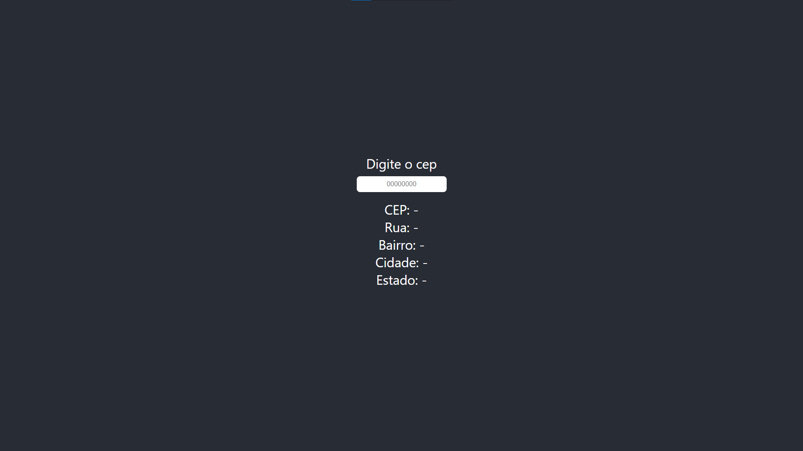
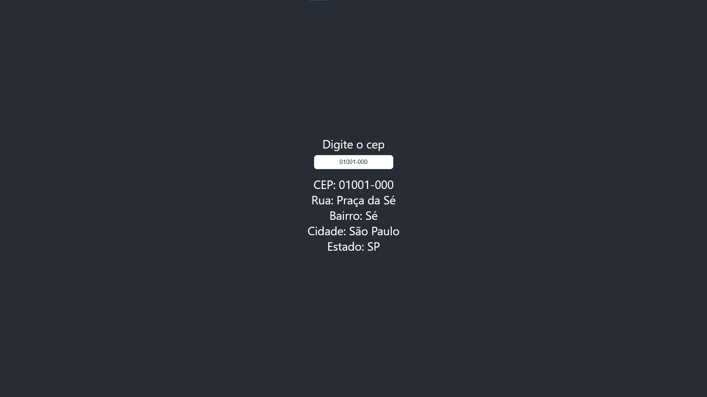

# Manipulando endereço com cep

## Sumário

1. [Objetivo](#objetivo)
2. [Como utilizar](#como-utilizar)
3. [Observações de utilização](#observações-de-utilização)

## Objetivo

Projeto criado para estudo do useState do react no qual, ao digitar o cep, o mesmo será atualizado na página como um todo e quando estiver com exatos 8 caracteres será realizada a busca do endereço, na API ViaCep.

## Como utilizar

Para utilizar essa aplicação, faça a clonagem deste repositório e tenha instalado o Node na máquina que será utilizada.

**Nota**: Durante o desenvolvimento, foi utilizado o Node 20.11.0, é recomendado utilizar a mesma versão para testar.

Com isso feito, entre na pasta e rode os seguintes comandos:

1. Comando para instalação dos pacotes utilizados pela aplicação.

```cmd
npm install
```

2. Comando para iniciar a aplicação.

```cmd
npm start
```

Dessa forma, assim que finalizar a instalação e a inicialização da aplicação, poderá acessar a página http://localhost:3000 e utilizá-la.

## Observações de utilização

Ao abrir a página, a seguinte interface será apresentada:



Nessa interface, pode ser visualizado que possui o campo "Digite o cep" e alguns espaços abaixo dele escrito "CEP", "Rua", "Bairro", "Cidade" e "Estado". O espaço "CEP" será alterado para o valor correspondente conforme digita no campo. Os outros espaços serão alterados quando o cep chegar a 8 dígitos.

Quando for digitar o CEP você pode digitar somente números, com ponto e, ou, com traço, o sistema reconhece e faz o tratamento adequado para todos os casos. Na apresentação do CEP será mostrado assim como foi digitado.

